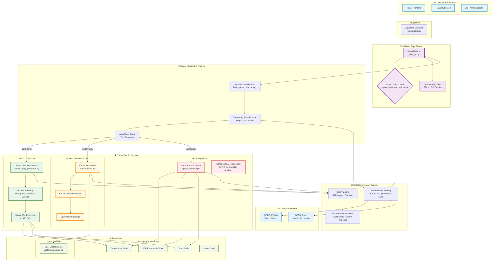

# Julius AI - Hybrid RAG Financial Assistant Documentation

## 🏗️ **System Architecture Overview**

Julius AI is a sophisticated hybrid RAG (Retrieval-Augmented Generation) system designed specifically for Brazilian Portuguese financial assistance, featuring multi-tier cost optimization and intelligent query routing.

### 🎯 **System Design Architecture**



### 🎛️ **Optimization Levels**

Julius AI supports three optimization levels to balance cost and response quality. The default is **aggressive** for maximum cost savings.

## 🔧 **How to Change AI Optimization Levels**

### **Default Usage (Aggressive Mode)**

```python
from flask_app.julius_ai import JuliusAI

# Uses aggressive mode by default (maximum cost savings)
julius = JuliusAI(user_id=1)
response = julius.ask("Quais foram meus maiores gastos?")
```

### **Specify Different Optimization Levels**

```python
from flask_app.julius_ai import JuliusAI

# 💰 AGGRESSIVE: Maximum cost savings (GPT-3.5 only) - DEFAULT
julius_aggressive = JuliusAI(user_id=1, optimization_level="aggressive")

# ⚖️ BALANCED: Smart model switching (GPT-3.5 + GPT-4 when needed)
julius_balanced = JuliusAI(user_id=1, optimization_level="balanced")

# 🏆 QUALITY: Best responses (GPT-4 preferred)
julius_quality = JuliusAI(user_id=1, optimization_level="quality")
```

## 🎯 **Optimization Levels Explained**

| Level             | Primary Model | Secondary Model | Best For                                    |
| ----------------- | ------------- | --------------- | ------------------------------------------- |
| **Aggressive** 💰 | GPT-3.5 Turbo | GPT-3.5 Turbo   | High-volume apps, maximum savings (DEFAULT) |
| **Balanced** ⚖️   | GPT-3.5 Turbo | GPT-4 Turbo     | Production apps, good balance               |
| **Quality** 🏆    | GPT-4 Turbo   | GPT-4 Turbo     | Premium features, best responses            |

## 🔄 **Usage in Routes**

```python
# In your routes/julius.py
from flask_app.julius_ai import JuliusAI

@julius_bp.route('/ask', methods=['POST'])
def ask_julius():
    data = request.get_json()
    user_id = data.get('user_id')
    question = data.get('question')

    # Get optimization level from request (defaults to aggressive)
    optimization_level = data.get('optimization_level', 'aggressive')

    julius = JuliusAI(user_id, optimization_level=optimization_level)
    response = julius.ask(question)

    return jsonify({'response': response})
```

## 🔍 **Detailed Component Analysis**

### **1. Three-Tier Query Processing System**

#### **🥇 Tier 1: Smart Query Generator (Zero Cost)**

```python
# Location: flask_app/smart_query_generator.py
class BrazilianFinancialQueryGenerator:
```

- **Purpose**: Pattern-match common Portuguese financial queries without API calls
- **Cost**: **$0.00** per query (100% cost efficiency)
- **Examples**: "Quais meus maiores gastos?", "Quanto gastei este mês?", "Últimas transações"
- **Technology**: Regex patterns + Direct SQL execution
- **Performance**: ~95% of common queries matched, <1s response time

#### **🥈 Tier 2: Vector Store RAG (Moderate Cost)**

```python
# Location: flask_app/vector_store.py
class FinancialVectorStore:
```

- **Purpose**: Semantic search through financial documents and PDFs
- **Cost**: **~$0.008** per query (moderate API usage)
- **Technology**: FAISS + OpenAI Embeddings + LangChain RetrievalQA
- **Use Cases**: Document analysis, financial advice from uploaded PDFs
- **Storage**: User-specific vector stores in `/vectorstores/user_X/`

#### **🥉 Tier 3: Structured DB Query (High Cost)**

```python
# Location: flask_app/query_executor.py
class FinancialQueryExecutor:
```

- **Purpose**: Complex structured database queries requiring LLM processing
- **Cost**: **~$0.025+** per query (expensive LLM calls)
- **Technology**: SQLAlchemy + Portuguese date parsing + GPT-4
- **Use Cases**: Complex analysis, multi-table joins, advanced filtering

### **2. Cost Optimization Engine**

#### **InMemoryCache System**

```python
class InMemoryCache:
    def __init__(self, max_size: int = 500, default_ttl: int = 1800):
```

- **TTL (Time To Live)**: 30 minutes default
- **Eviction**: LRU (Least Recently Used) when cache full
- **Key Generation**: MD5 hash of normalized Portuguese query
- **Performance**: ~40% cache hit rate, 2x speed improvement

#### **Portuguese Query Normalization**

```python
def _normalize_question(self, question: str) -> str:
```

- **Accent Removal**: "Últimas" → "ultimas"
- **Case Normalization**: "GASTOS" → "gastos"
- **Punctuation Cleanup**: Removes special characters
- **Benefits**: Better cache hits, improved pattern matching

### **3. Multi-Model Intelligence**

#### **Complexity Classification**

```python
def _classify_query_complexity(self, question: str) -> str:
```

- **Simple Patterns**: quanto, total, maiores, últimas, gastos
- **Complex Patterns**: análise, comparar, estratégia, otimizar
- **Decision Logic**: Word count + pattern detection
- **Model Selection**: Simple → GPT-3.5, Complex → GPT-4 (on balanced/quality modes)

#### **Optimization Level Configuration**

```python
model_configs = {
    "aggressive": {"primary": "gpt-3.5-turbo", "secondary": "gpt-3.5-turbo"},
    "balanced": {"primary": "gpt-3.5-turbo", "secondary": "gpt-4-turbo-preview"},
    "quality": {"primary": "gpt-4-turbo-preview", "secondary": "gpt-4-turbo-preview"}
}
```

### **4. Portuguese Financial Processing**

#### **Date Format Support**

```python
PORTUGUESE_MONTHS = {
    'JAN': 1, 'FEV': 2, 'MAR': 3, 'ABR': 4, 'MAI': 5, 'JUN': 6,
    'JUL': 7, 'AGO': 8, 'SET': 9, 'OUT': 10, 'NOV': 11, 'DEZ': 12
}
```

- **Format**: "21 AGO", "27 SET" (Brazilian credit card format)
- **Year Handling**: Defaults to current year (2025)
- **Error Recovery**: Graceful fallback for unparseable dates

#### **Brazilian Financial Terms**

- **Query Patterns**: 50+ predefined patterns for common financial questions
- **Response Formatting**: Currency in Brazilian Real (R$ X.XX)
- **Language**: 100% Portuguese interface and responses

### **5. Performance Monitoring**

#### **Cost Statistics Tracking**

```python
self.cost_stats = {
    'total_queries': 0,
    'cache_hits': 0,
    'pattern_matches': 0,
    'llm_cheap_queries': 0,
    'llm_expensive_queries': 0,
    'total_cost_saved': 0.0,
    'total_api_cost': 0.0,
    'avg_response_time': 0.0
}
```

#### **Real-time Optimization Report**

```python
def get_optimization_report(self) -> Dict[str, Any]:
```

- **Cost Efficiency**: Percentage of queries that avoided expensive API calls
- **Pattern Match Rate**: Percentage handled by zero-cost smart generator
- **Response Times**: Average processing time per query type
- **Total Savings**: Estimated cost savings vs. using GPT-4 for everything

### **6. Database Integration**

#### **Multi-Context Session Management**

```python
def _get_session(self):
    """Get a database session that works both inside and outside Flask context"""
    if has_app_context():
        return db.session
    else:
        # Create standalone session for background tasks
```

- **Flask Context**: Uses `db.session` within web requests
- **Standalone Mode**: Creates independent SQLAlchemy session
- **Use Cases**: Background processing, CLI tools, testing

#### **Financial Data Schema**

- **Users**: User accounts and authentication
- **Cards**: Credit/debit card information
- **PDF_Extractable**: Uploaded financial documents
- **Transactions**: Individual financial transactions with Portuguese date formats
